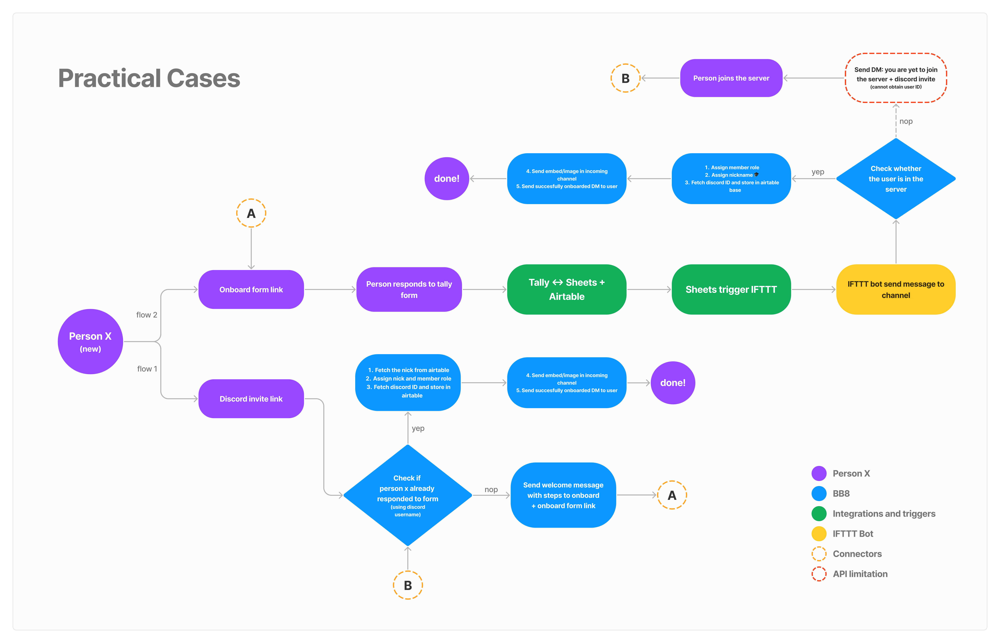
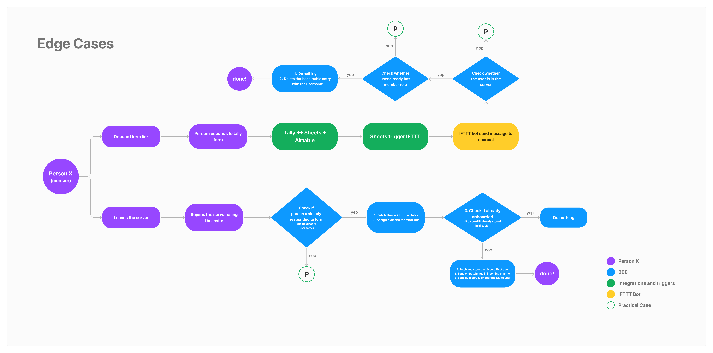

### A bit of context

Well if you're not sure what this page is about then I'll give you some context: This is a brief about ~~how I managed~~ **why I decided** to code Baymax - A Discord bot which is designed to moderate TinkerHub NSSCE's official [Discord server](https://discord.gg/2bBPbdRud6). And apparently this is my first (real) blog post 🐌, so do read through and comment your genuine thoughts.

### So here's how it started ¯\\\_(ツ)\_/¯
Managing a community is a form of art. An art that can get frustrating over time. As your community grows so does it's core values & directions start fading away. Each new member brings in new ideas & perspectives to the table - all of which builds upon the existing foundation of the community. Eventually the foundation gets abandoned - the structure above seems to be self sustaining & capable of withstanding any and all external impacts. But applying rational thought, anyone can observe that the maintainence of the foundation is as much as important as building the structure above - only then can the building/community stand the test of time.

Okay! Maybe all that wisdom talk went over your head. Don't worry that's fine, the analogy wasn't thought out well. Anyway what I'm trying to say is that - If you're bound to commit to any repetitive actions in order to maintain a healthy community while preserving it's original values, they get tedious and exhausting over time (SPOILER: unless you're a bot). I've personally dealt with this problem and yeah I did come up with a workaround. Wonder how? I automated all the actions ^_~

### The actual problem
Our [discord server](https://discord.gg/2bBPbdRud6) initially started out as a small, quiet and modest place where anyone interested in our community can join, hang out and connect with each other. Since it was still in it's nascent phase and had only a handful of members it was easy to keep track and moderate all of them with a small mod team. But as the server started to grow, the need for a more efficient moderation and member verification system arose. Why? You might ask. I heard you.. its because if you've been using discord for atleast a while now, you might have realized - only a minority of users present their real identities/names. This is not something we can endorse in a real community. Communities are built over mutual trust and respect for each other and this requires everyone to present their real identies as a first step. This holds true regardless of the platform used by the community.

Around the same time this problem arose, our campus community chapter had an execom shift and I joined the team as the Tech Lead. Having worked in the bot development team at [µLearn](https://mulearn.org/) - I had some experience with discord.py. I initially set out to build something similar to the onboarding process in the µLearn's discord server handled by [Aaronchettan](https://www.instagram.com/p/ChpWrJevSaq/). In fact TBH I did end up using a lot of inspiration from it's codebase (CTRL^C + CTRL^V). But yet today Baymax has evolved into something completely unique except for the core idea - a bot to help manage a community.

### The workaround
If you've watched [Big Hero 6](https://www.imdb.com/title/tt2245084/) you're probably famliar with Baymax - the huggable robot built to help a lot of people. Being a fan of the movie and the robot in specfic I tried to build one myself - a bot designed with the sole purpose of helping and guiding people. Well maybe not a physical version but a discord version. I just completed it a few days back and now its up and running. Though originally I only planned for it to automate the onboarding process, as I started developing it, I thought why stop there. So I just kept adding more features. Here's an overview what Baymax can do right now:-

- It automatically assigns roles and a nickname from the response received in an airtable form
- It can have natural conversations with members and answer questions about itself, TinkerHub etc (uses DialogFlow for NLP)
- It can make you laugh with jokes or lighten you up with inspiring quotes
- It can find the latest hot news in tech and deliver them directly to the server (sources: HackerNews & Dev.to)

There certainly is a lot more he can do, if you're curious enough then you should find out for yourself by joining our server here 👉 https://discord.gg/2bBPbdRud6 (I swear this is not promotion!!). 

We even had bigger plans for Baymax, as you might have known hacktoberfest'22 was just around the corner. So we thought, why not make Baymax open source. With contributions from new comers/existing open source devs, the bot would keep getting better and maybe even evolve into something more. Here's the repo link: https://github.com/Tinkerhub-NSSCE/baymax. There's still 2 days left to win the t-shirt so why not give it try. Sadly we haven't recieved any major PRs so far, but again you can always contribute to Baymax even after Hacktoberfest, we can get you a cooler t-shirt (maybe..)

This is certainly not a technical blog and so I wouldn't go deep into how Baymax was built. This is just an overview of why baymax exists and why it was built, hope you got an idea of the same. I could not think of a better place to share my thoughts. Perhaps I'll  write another blog on how I coded the bot sometime in the future (We'll see). However if you're still prying at the build of the bot, I've listed out the major libraries/tools I've used to create Baymax along with the project source in the next section

### What's under the hood?
- [discordpy](https://discordpy.readthedocs.io/en/stable/)
- [dialogflow](https://cloud.google.com/dialogflow/es/docs)
- [google-cloud-dialogflow](https://googleapis.dev/python/dialogflow/latest/index.html)
- [pyairtable](https://pyairtable.readthedocs.io/en/latest/)
- [pillow](https://pillow.readthedocs.io/en/stable/) 
- [project-source](https://github.com/Tinkerhub-NSSCE/baymax)

### Some exclusive BTS photos from the dev phase

> _That's all for now. That was my first blog post. Will I write more stuff?_ 🤔 _Depends on whether I'll chose to procastinate again_
