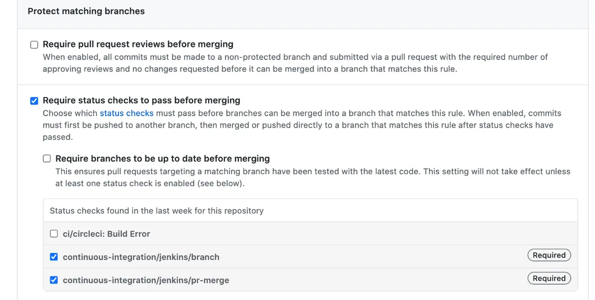
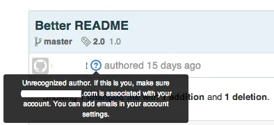
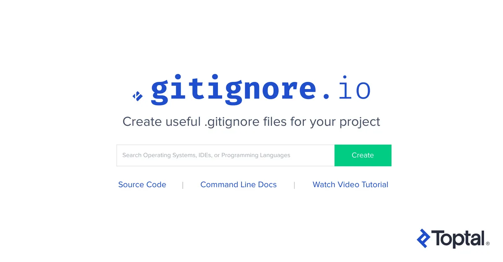
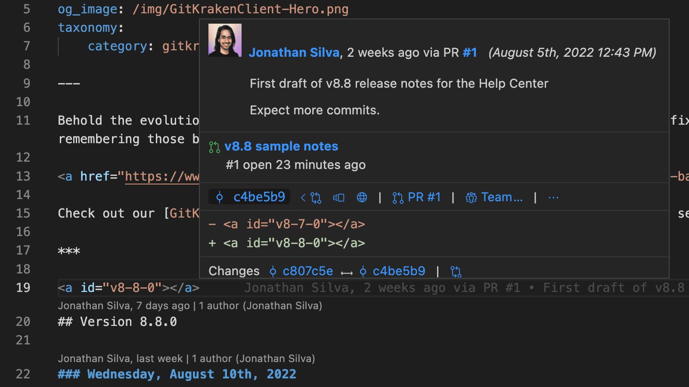

> _**Disclaimer:**_ _I am not an expert in Git/GitHub. All content ahead were adapted & compiled from multiple sources on the Internet. Please excercise caution if you choose to take any of the content seriously, since this is only an opiniated viewpoint of a noob coder_

Okay that was a joke xD.. But again my views are based on the limited experience I have with git, github and version control. So do your own googling & research before applying any of the practices mentioned in here. If used irresponsibly git could potentially mess up your entire codebase. That said we'll now move on to the actual objective: learn how to _**git it**_ responsibly.

### Git, Set, Go!
Git is an integral part of a developer’s workflow. No matter what organization or development team you go to, Git is ever-present in some form.

```bash
$ man git
> NAME: git - the stupid content tracker
```
As the man page for `git` reads, it is a _**content tracker**_ and it is pretty _**stupid**_, unless you train it and guide it to make it smart. How? Read on.

> **10 ways to make Git (and Github :D) smart**

### 1. Don’t git push straight to master
Regardless if you use Gitflow or any other git branching model, it is always a good idea to turn on git branch protection to prevent direct commits and ensure your main branch code is deployable at all times. All commits should be pushed to master through pull requests.



### 2. Don’t commit code as an unrecognized author
Sometimes you commit code using the wrong email address, and as a result GitHub shows that your commit has an unrecognized author. Having commits with unrecognized authors makes it more difficult to track who wrote which part of the code.

Ensure your Git client is configured with the correct email address and linked to your GitHub user. Check your pull requests during code reviews for unrecognized commits.



### 3. Require commit signing
Commit signing is a process of cryptographically signing the code merge for verification and traceability. This is important for code audit trails because it is not hard to pretend to be someone else in a commit. All it takes is a malicious user to change their username and email address in git config and push an exploitive code merge.

You can set up your Git to sign commits through GPG and configure your commits with a private key in your git config. Once this is done, you can [add your GPG key to Github](https://docs.github.com/en/authentication/managing-commit-signature-verification/adding-a-gpg-key-to-your-github-account). Now when commits are made, a ‘verified’ badge shows up next to the commit.


### 4. Create a meaningful git ignore file
A .gitignore file is a must in each repository to ignore predefined files and directories. It will help you to prevent secret keys, dependencies and many other possible discrepancies in your code. You can choose a relevant template from [gitignore.io](https://www.toptal.com/developers/gitignore) to get started quickly.



### 5. Enforce 2-factor authentication

While 2FA can not be considered an end-to-end method of protecting from data breaches, two-factor authentication (2FA) is now the industry standard for account security. It should also be your organization’s standard security requirement to prevent code leakages through insecure accounts.

2FA adds an extra layer of security when logging into GitHub and can be enforced at the organizational level through your organization’s settings. To do this, navigate to your organization list, select ‘Organization security’ and under ‘Authentication’ select ‘Require two-factor authentication for everyone’.

When you click ‘Save’, you may be prompted with details concerning individuals who do not have 2FA activated. They will be removed from the organization and can only be added back in once 2FA has been implemented on their account. You can view members who have been removed in your organization’s audit logs.

### 6. Don’t commit local config files into source control
I strongly recommend against committing your local config files to git. Usually, those are private configuration files we don’t want to push to remote because they are may hold secrets, personal preferences, history or general information that should stay only in your local environment.

### 7. Use a branch naming convention
Adopting a consistent branch naming convention is essential to keeping our repository organized as our team grows in size. An efficient naming convention will allow our to keep merge conflicts at a minimum while ensuring your developers are as productive as possible.

While there are many branch naming conventions, one of the most popular ones is known as [git flow](https://nvie.com/posts/a-successful-git-branching-model/).


### 8. Archive dead repositories
Over time, for various reasons, we find ourselves with unmaintained repositories. Sometimes developers create repos for an ad hoc use case, a POC, or some other reason. Sometimes they inherit repos with old and irrelevant code.

In any of these cases, the repos were left intact. No one is doing any development work in those repos anymore, so you want to clean them up and avoid the risk of other people using them. The best practice is to archive them, i.e. make them “read-only” to everyone.

### 9. Define code owners for faster code reviews
When you’re dealing with dozens, hundreds, or more repositories and engineers, it’s nearly impossible to know who owns which parts of the codebase and need to review your changes.

Even in smaller teams you’d still have code owners – for example, front-end code changes should be reviewed by the Front-End Engineer.

Use [Code Owners](https://docs.github.com/en/repositories/managing-your-repositorys-settings-and-features/customizing-your-repository/about-code-owners) feature to define which teams and people are automatically selected as reviewers for the repository.


### 10. Leverage task lists
Tasks lists provide a way for you to track TODOs directly within comments, issues, and even markdown files within your repository.

They provide an excellent way to capture a high-level overview of a task or issue, as well as keep others up-to-date on its state. You should definitely try out this feature!


### BONUS: Try GitLens
> _This is not promotion_

I just started using [this extension](https://marketplace.visualstudio.com/items?itemName=eamodio.gitlens) on VS-Code a few weeks back and found it super useful - specifically to `blame` people :).
A `blame` in git-jargon means the dev who last modified a particular line in a file to ruin the whole project. In short git blame helps you _blame_ for real.

GitLens just makes it easier to blame your fellow devs. No more commands or terminal screens, just open your file to see the commit and author who last modified any line. Isn't that (super)cool?



### Did you git it?
We devs spend a lot of time working with Git and GitHub, so investing in improving your Git/GitHub practices makes a lot of sense. Implementing the practices mentioned in this guide could (possibly?) help you improve your developer productivity and reduce security risks.